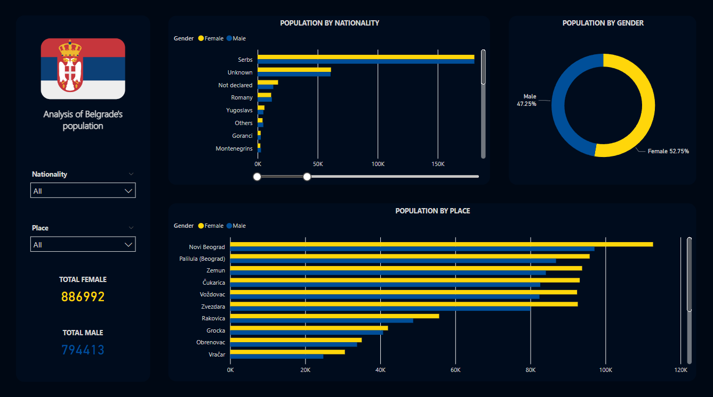

# Belgrade's Population Analysis

The "Belgrade's Population Analysis" project delved into the intricacies of demographic data in Belgrade. Utilizing advanced data analysis and visualization techniques, the project aimed to unveil significant insights into population distribution, trends, and dynamics within the city.

## Objective:
The primary goal was to establish a comprehensive understanding of Belgrade's population composition and behaviors. By extracting meaningful patterns from demographic data, the project sought to inform decision-making processes related to urban planning, resource allocation, and community services.

## Methodology:
The project followed a systematic approach:

1. Data Collection and Preparation: Curated a robust dataset from reliable sources, rigorously ensuring data accuracy and reliability through thorough cleansing and validation.

2. Data Analysis and Visualization: Employed advanced data analysis techniques and Power BI to create dynamic visualizations, including bar charts and donut charts, effectively conveying intricate demographic patterns.

3. Key Visualizations:
The project culminated in a series of impactful visualizations:
- An informative bar chart illustrating the distribution of residents across different nationalities.
- A comprehensive bar chart displaying population distribution across various residential areas.
- A succinct donut chart providing a clear gender composition comparison within Belgrade's population.

## Impact:
The insights garnered hold significant implications for urban planning and community development in Belgrade. By presenting accurate demographic insights through dynamic visuals, the project empowers decision-makers to take informed actions, leading to targeted interventions, effective resource allocation, and an improved quality of life for Belgrade's residents.

In summary, the "Belgrade Population Analysis" project underscores my proficiency in data analysis, advanced visualization techniques, and the utilization of tools such as Power BI. Through this endeavor, I've demonstrated the ability to transform raw demographic data into actionable insights, contributing to the creation of responsive and thriving urban environments.

